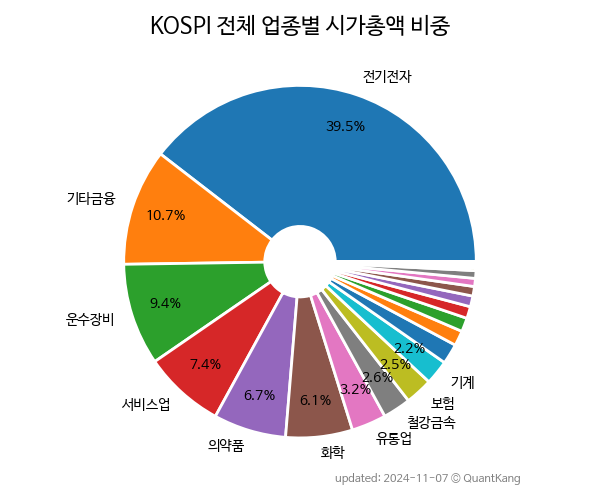
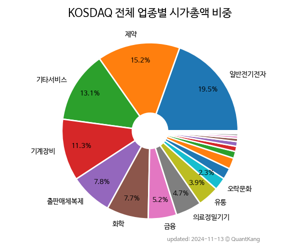
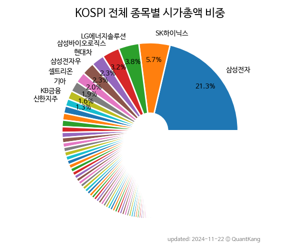
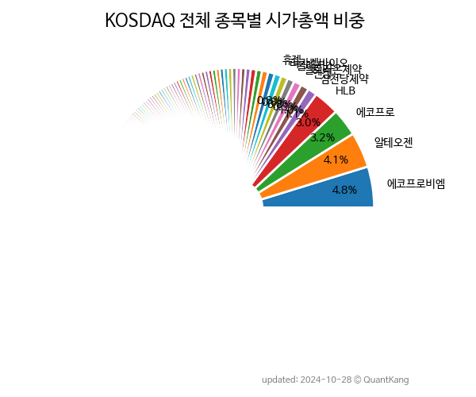

> **재무 데이터 기반 지표**[^fn_finance_metric]

재무 지표 중 하나를 기준으로 다른 재무 지표를 살펴 볼 수 있습니다.



> **업종별 비중**

| **KOSPI** | **KOSDAQ** |
| :-------: | :--------: |
|  |  |

> **[종목별 비중](sector/)**

| **KOSPI** | **KOSDAQ** |
| :-------: | :--------: |
|  |  |

> **시장**

| **종목수 기준** | **시가총액 기준** |
| :-------------: | :---------------: |
|  |  |

> **지역**

| **종목수 기준** | **시가총액 기준** |
| :-------------: | :---------------: |
| KRX ||
|  |  |
| KOSPI ||
|  |  |
| KOSDAQ ||
|  |  |

<!---

> **업종**

| **갯수 기준** | **시가총액 기준** |
| :-----------: | :---------------: |
| KRX | |
|  |  |
| KOSPI ||
|  |  |
| KOSDAQ ||
|  |  |
--->

> **결산 월**

| **종목수 기준** | **시가총액 기준** |
| :-------------: | :---------------: |
| KRX ||
|  |  |
| KOSPI ||
|  |  |
| KOSDAQ ||
|  |  |


